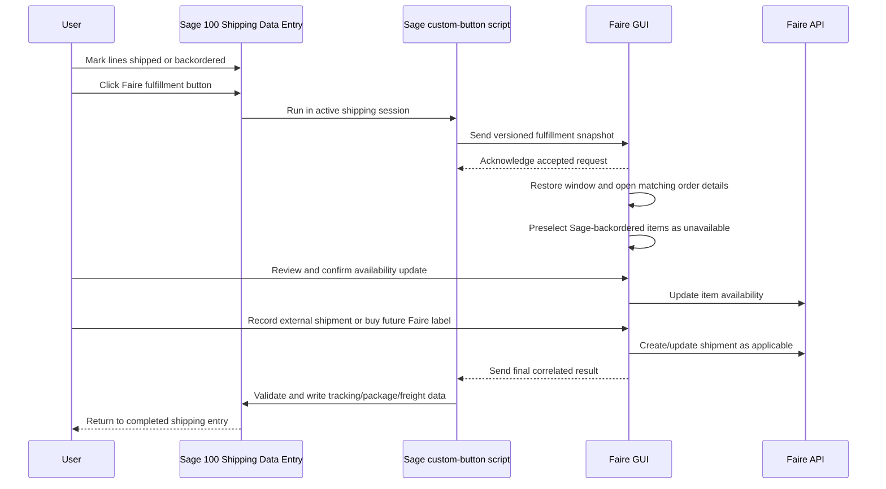

# Sage 100 ↔ Faire Fulfillment Integration Plan

## 1. Purpose

Build a Sage 100 Shipping Data Entry integration that lets a user make shipment and backorder decisions in Sage, complete the related Faire fulfillment work in the Faire GUI, and return the final shipment data to the still-open Sage session.

The integration must support two fulfillment paths in one coherent workflow:

1. **Record an externally purchased shipment** — enter a shipment that was bought outside Faire and record it in Faire.
2. **Buy a shipping label through Faire** — a future capability, enabled only after Faire publishes a suitable label-purchase API.

The first path can be built before a Faire label API exists. The second must reuse the same order, package, validation, Sage context, and writeback workflow rather than becoming a separate feature.

---

## 2. Decisions already made

| Decision                                                                                               | Rationale                                                                                                                                                                                                                                                       |
| ------------------------------------------------------------------------------------------------------ | --------------------------------------------------------------------------------------------------------------------------------------------------------------------------------------------------------------------------------------------------------------- |
| Keep Sage Shipping Data Entry open while the Faire workflow is completed.                              | The Sage shipped/backordered selections and the Faire action form one fulfillment transaction. Keeping Sage open prevents accidental edits to the source shipment before the result is written back.                                                            |
| Use a purpose-built Sage script rather than modify `LaunchFaireGUI.vbs` in place.                      | The SSK script combines extraction, pipe communication, an SSK-specific protocol, and Sage writeback. Reusing its architecture is useful; preserving its implementation and protocol is not.                                                                    |
| Use a local inter-process communication channel between Sage and the already-running Faire GUI.        | The integration is workstation-local, does not need a network service, and should not require the Faire GUI to create its own Sage session. A Windows named pipe is the preferred transport unless implementation constraints require a local HTTP alternative. |
| The Faire GUI restores/focuses/navigates itself.                                                       | The application is the reliable owner of its own window state. The Sage script should ask it to activate, not attempt external window manipulation.                                                                                                             |
| The Sage sales-order PO number is the exact Faire order display ID.                                    | This provides a deterministic direct order lookup. The existing display-ID helper already supports the expected identifier form.                                                                                                                                |
| A Sage backorder always means the corresponding SKU is globally unavailable.                           | The Faire GUI may safely preselect the item as out of stock when Sage reports it as backordered.                                                                                                                                                                |
| Preselect imported out-of-stock items, but require one explicit Faire confirmation.                    | This removes duplicate item-by-item work while retaining a visible, reversible review step before Faire is changed.                                                                                                                                             |
| Extend the existing Order Details screen instead of creating a separate fulfillment page.              | That screen already displays order items, availability actions, package/shipment entry, and shipment state. A Sage-specific fulfillment session is a mode of the current order detail, not a separate order model.                                              |
| Sage uses an explicit backordered quantity; it does not infer backorders from a zero shipped quantity. | A zero shipped quantity can mean an unselected or non-fulfillment line. The explicit value preserves Sage's decision and makes the payload auditable. The proposed field is `QUANTITYBACKORDERED`, pending Sage 100 2025 validation.                            |
| Sales-kit components map to the kit SKU, rather than the component SKU.                                | Faire availability must reflect the ordered kit item. The GUI will use the Sage kit relationship fields to resolve the parent kit line.                                                                                                                         |
| Existing Sage tracking/package records are replaced.                                                   | The current Sage shipment result is authoritative; merging stale records could create duplicate tracking or incorrect allocations.                                                                                                                              |
| Existing freight markup rules remain in effect.                                                        | The current business policy remains unchanged while the Faire shipping capability is introduced.                                                                                                                                                                |
| Tare weight and weight-validation behavior are out of scope.                                           | They are not needed for the planned fulfillment workflow.                                                                                                                                                                                                       |
| The Faire connection is selected from the sales source.                                                | The proposed Sage source is `SO_SALESORDER.UDF_SALES_SOURCE`; the GUI must reverse the existing brand-to-sales-source mapping after this field is verified in Sage.                                                                                             |
| Sage remains responsible for Sage writeback.                                                           | The active Sage script has the correct Sage session and UI context. The Faire GUI produces a correlated final result; it should not independently log into Sage or mutate Sage records.                                                                         |

---

## 3. Existing assets and how they will be used

### 3.1 Existing Sage script: `Sage/LaunchFaireGUI.vbs`

Use this file as a behavioral and Sage Business Object Interface reference only.

Useful concepts to retain:

- accessing the active Sage business object (`oBusObj`);
- reading additional related Sage objects;
- collecting header, customer, ship-to, item, and tracking data;
- communicating with a local desktop process through a workstation named pipe;
- performing final Sage tracking/package/freight writeback while Shipping Data Entry remains open.

Do **not** retain unchanged:

- the fixed `SSKpipeIn` and `SSKpipeOut` names;
- the SSK line-oriented response commands (`Start`, `Write`, `Done`, etc.);
- the broad `On Error Resume Next` error handling pattern;
- the hand-built general-purpose JSON serializer;
- the assumption that every payload line has `QuantityShipped > 0`;
- SSK-specific record-removal and writeback behavior without an explicit business rule.

### 3.1.1 Initial purpose-built script: `Sage/LaunchFaireFulfillment.vbs`

An initial protocol-v1 bridge has been created. It sends explicit shipped and backordered line quantities, the Faire display ID, the proposed sales-source UDF, kit relationship fields, ship-to data, and freight data through `FaireGUIFulfillmentIn`. It waits for a typed response through `FaireGUIFulfillmentOut`, validates its request/order/invoice identity, and replaces Sage tracking/package records only after validation.

The script is **not production-verified**. It requires a compatible GUI named-pipe listener and manual Sage 100 2025 validation of object names, return values, UDF names, field names, and writeback behavior before installation.

### 3.2 Field mappings: `Sage/FieldMappings.json`

Use this as the initial Sage data dictionary. Build a narrower, explicitly versioned **Sage fulfillment snapshot** rather than forwarding every mapped field.

High-priority header data:

- `SalesOrderNo`;
- `InvoiceNo` or the active shipping/invoice reference, when present;
- `CustomerPoNo` — the exact Faire display ID lookup key;
- `SalesSource` — proposed as `SO_SALESORDER.UDF_SALES_SOURCE`, pending Sage validation; the GUI uses it to select the Faire connection;
- `ShipVia`;
- `FreightAmt`, only for configured freight-writeback behavior;
- ship-to recipient, company, address, country, phone, and email.

High-priority detail data:

- Sage line key;
- item code/SKU;
- item description;
- item type;
- quantity shipped;
- **quantity backordered — proposed as `QUANTITYBACKORDERED`, added to the mapping and pending Sage 100 2025 validation**;
- sales-kit parent/child fields; components must resolve to the kit SKU rather than component SKU.

Defer until there is a proven need:

- commodity, manufacturing-country, customs, EEI, and incoterm fields;
- unit cost and other export-value fields;
- insurance and delivery-special-instruction fields.

### 3.3 Package catalog: `Sage/Packages.json`

Reuse the human-facing package choices, display order, and manual dimensions as the initial package catalog for the Faire GUI.

Separate the provider-neutral package information from provider-specific package identifiers:

- retain display name, dimensions, and optional tare weight;
- retain carrier-specific packaging names as user-facing templates;
- do not assume existing EasyPost values such as `SmallFlatRateBox` match Faire’s future shipping-label API;
- add future Faire provider mappings only when Faire documents valid package identifiers.

### 3.4 Ship-code rules: `Sage/ShipCodes.json`

Reuse the operational policy encoded by the Sage `ShipVia` values, but convert it to a provider-neutral configuration model.

Each rule should express:

- exact Sage `ShipVia` value;
- preferred carrier;
- preferred service;
- payment party, when supported;
- freight writeback policy (`Cost` or disabled);
- optional markup policy;
- whether the rule is available for external shipment recording, direct label purchase, or both.

Do not treat EasyPost service strings as permanent Faire API values. Values such as `FEDEX_GROUND`, `GroundAdvantage`, and `3DaySelect` must be mapped to Faire-supported values only after Faire documents its API.

### 3.5 SSK settings: `Sage/AppSettings.json`

Do not copy this file into the new integration.

It contains legacy provider settings and sensitive Sage/license configuration. Extract only intentional, non-secret business settings into a new application configuration model. Keep credentials and API secrets out of tracked JSON files and in the application’s secure local configuration/storage.

If this configuration has been shared beyond the intended trusted team, treat existing credentials and license material as candidates for rotation.

---

## 4. Target architecture



### 4.1 Responsibility boundaries

| Component                 | Responsibilities                                                                                                                                                                  | Must not do                                                                    |
| ------------------------- | --------------------------------------------------------------------------------------------------------------------------------------------------------------------------------- | ------------------------------------------------------------------------------ |
| Sage custom-button script | Read the active Sage shipment state, validate basic inputs, start/monitor the local session, validate final result, write approved data back to Sage.                             | Call Faire directly, own Faire credentials, or implement Faire business rules. |
| Faire GUI                 | Receive the request, persist session state, focus/navigate, load the Faire order, preselect availability, collect package/shipping input, call Faire APIs, return a final result. | Open an independent Sage login/session or directly modify Sage data.           |
| Faire API adapter         | Implement authenticated Faire order, availability, shipment, and future-label API calls.                                                                                          | Know Sage object names or Sage UI state.                                       |
| Configuration             | Express package templates, Sage ship-code policy, field requirements, and environment-independent rules.                                                                          | Store secrets in version-controlled files.                                     |

### 4.2 Why the workflow waits

The script should wait for a **terminal result** from the Faire GUI because it is responsible for applying final Sage-side tracking, package, and freight updates to the active Shipping Data Entry record.

Waiting is appropriate, but the design must account for the fact that no distributed transaction exists between Sage and Faire:

- Faire can succeed while Sage writeback fails;
- the desktop app can close while Sage waits;
- a pipe connection can fail after a label purchase;
- a user can cancel before an irreversible action;
- a retry must not buy or record the same shipment twice.

The Faire GUI must therefore persist the session and terminal result locally, keyed by a unique request ID. Sage retries must ask for the existing result before any duplicate submission is attempted.

---

## 5. Integration protocol and session lifecycle

### 5.1 Protocol requirements

Define a versioned, structured protocol before implementing either side.

Required properties:

- protocol version;
- unique request ID generated by the Sage script;
- message type;
- explicit success, cancellation, and failure states;
- bounded timeout and periodic keepalive/status updates while Sage waits;
- final result persisted by the Faire GUI before it is returned;
- idempotency: the same request ID must reopen or return the existing session/result, not create a duplicate transaction;
- local-only access with user/workstation permissions appropriate for the pipe implementation;
- safe, user-readable errors without exposing credentials, internal paths, or raw API responses.

### 5.2 Request shape

The exact serialization format is an implementation decision, but the payload must contain the following logical data.

```text
FulfillmentRequest
  protocolVersion
  requestID
  createdAt
  source
    companyCode
    workstation
    Sage user, if needed for audit only
  document
    salesOrderNo
    invoiceOrShipmentNo
    customerPoNo
    faireDisplayID
    shipVia
    currentFreightAmount
  shipTo
    name, company, address, city, state, postal code, country, phone, email
  lines[]
    sageLineKey
    itemCode
    description
    itemType
    quantityOrdered, if required for validation
    quantityShipped
    quantityBackordered
    sales-kit relationship, if relevant
  policy
    matched Sage ShipVia rule
    carrier/service preference
    freight writeback behavior
```

Rules:

- Send **all affected fulfillment lines**, including a line with zero shipped quantity and positive backordered quantity.
- Never infer a Faire variant solely from a non-unique description.
- Preserve raw Sage line identity for final audit and package allocation.
- Do not send unrelated accounting, customer, or sensitive data merely because it is available from Sage.

### 5.3 Response shape

```text
FulfillmentResult
  protocolVersion
  requestID
  status: completed | cancelled | failed | awaiting-user
  faireOrderID
  faireDisplayID
  availabilityUpdate
    submitted variants
    result status
  shipment
    fulfillment method: external-recording | faire-label-purchase
    carrier
    service
    tracking numbers
    label/reference IDs
    package data and Sage line allocations
    purchased cost and currency, if applicable
  Sage writeback
    whether freight should be written
    freight amount
    tracking/package records to create or replace
  user-facing error, if failed
```

The final response must contain only data Sage is authorized to write back. It must not be a generic instruction stream capable of setting arbitrary Sage fields or invoking arbitrary Sage objects.

### 5.4 Lifecycle

1. User marks items as shipped or backordered in Sage Shipping Data Entry.
2. User clicks the Faire fulfillment button.
3. Script validates that the active record is eligible and that the Faire GUI listener is available.
4. Script reads the fulfillment snapshot and generates a unique request ID.
5. Script sends the request to the already-running Faire GUI.
6. Faire GUI persists or reloads the session by request ID, acknowledges it, restores/focuses its window, and opens the matching order.
7. Faire GUI loads the Faire order using the exact display ID from the Sage PO number.
8. Faire GUI maps Sage lines to Faire variants and preselects valid backordered variants as unavailable.
9. User reviews the imported session and explicitly confirms the availability update.
10. User selects an allowed fulfillment method:
    - record an external shipment; or
    - later, buy a Faire label.
11. Faire GUI persists the terminal result before signaling completion.
12. Sage validates that the returned request/document identity still matches the active transaction.
13. Sage applies tracking, package, and permitted freight updates once.
14. Sage refreshes its relevant UI state and reports the outcome.

### 5.5 Cancellation, failures, and recovery

| Situation                                          | Required behavior                                                                                                                                             |
| -------------------------------------------------- | ------------------------------------------------------------------------------------------------------------------------------------------------------------- |
| Faire GUI is not running                           | Sage reports a clear launch/restart instruction and does not change Sage data.                                                                                |
| Request received twice                             | Faire GUI reopens the existing session or returns its existing result. It does not submit another availability update or purchase another label.              |
| User cancels before Faire changes                  | Faire GUI returns `cancelled`; Sage makes no writeback changes.                                                                                               |
| Availability update fails                          | Keep the imported selections visible and retryable; do not allow shipment completion that requires the update.                                                |
| Faire shipment/label succeeds but response is lost | Persist the completed result. A Sage retry retrieves/replays it without repeating the Faire action.                                                           |
| Sage writeback fails                               | Faire GUI retains the completed result and clearly indicates that Sage writeback remains pending. The operator can retry from the same Sage document/session. |
| Session idle timeout                               | Faire GUI shows a warning; Sage offers a cancel/retry path. Timeout must not discard a completed external action.                                             |
| Mapping is ambiguous or missing                    | Do not automatically mark availability. Show the exact unmatched Sage line and require resolution.                                                            |

---

## 6. Sage custom-button script plan

### 6.1 New script purpose

Create a new script with a purpose-specific name, such as a Faire fulfillment launch/return script. It should be installed as a custom button in Sage 100 2025 Shipping Data Entry.

The script must be small and narrowly scoped:

- create and send a fulfillment snapshot;
- coordinate the waiting session;
- receive a safe final result;
- perform approved Sage writeback;
- display actionable errors.

It should not become a second implementation of Faire order or label logic.

- [x] Create the initial protocol-v1 script at `Sage/LaunchFaireFulfillment.vbs`.
- [ ] Manually validate the initial script in the target Sage 100 2025 environment before installing it for operators.

### 6.2 Sage discovery and verification tasks

Before writing the script, verify these details in the target Sage 100 2025 environment and document the result in the implementation notes:

- [ ] Confirm the exact custom-button script context in Shipping Data Entry.
- [ ] Confirm which active business object represents the shipment/invoice state.
- [ ] Confirm the exact field name and semantics for backordered quantity. The initial script and mapping use proposed `QUANTITYBACKORDERED`; change both if Sage exposes a different field.
- [ ] Confirm whether shipped/backordered choices are stored before the button action and remain valid while the script waits.
- [ ] Confirm access to sales order, customer, ship-to, line, item, and kit-related child objects.
- [ ] Confirm the expected behavior for lines such as comments, miscellaneous charges, and non-inventory item types.
- [ ] Confirm invoice/shipment identity availability before the user posts/completes Shipping Data Entry.
- [ ] Confirm the approved Sage object/API methods for creating/replacing invoice tracking and package tracking records.
- [x] Decide existing tracking behavior: replace existing tracking/package records.
- [ ] Confirm the approved Sage object/API methods for the replacement behavior in the target environment.
- [ ] Confirm the approved method to update `FreightAmt` and refresh the Sage UI.
- [ ] Confirm expected locking/concurrency behavior when the script remains open during a fulfillment session.
- [ ] Test named-pipe access under the actual Windows user and Sage workstation setup.

### 6.3 Snapshot extraction tasks

- [ ] Define the versioned fulfillment request contract before coding extraction.
- [ ] Read the current sales order, invoice/shipment, PO number, ship-via value, and freight amount.
- [ ] Validate the PO number as a Faire display ID using the application’s existing normalization rules.
- [ ] Read ship-to data required for shipment creation and future labels.
- [x] Add explicit shipped and proposed-backordered quantity extraction to the initial script.
- [ ] Validate both quantity fields against actual Sage Shipping Data Entry data.
- [ ] Include stable Sage line keys and item codes for matching/audit.
- [x] Include Sage kit relationship fields in the initial request.
- [ ] Verify actual sales-kit field semantics and implement GUI resolution to the parent kit SKU.
- [ ] Exclude irrelevant/non-fulfillment lines using verified item-type rules.
- [ ] Reject an empty shipment/backorder snapshot with a clear Sage message.
- [ ] Use a controlled serializer for the defined protocol; do not serialize every Sage column generically.

### 6.4 IPC tasks

- [ ] Select the final local transport: Windows named pipe unless implementation proves a local HTTP listener is materially simpler and equally secure.
- [ ] Choose a versioned Faire-specific pipe/listener name.
- [ ] Support a unique request ID instead of fixed, anonymous request/response channels.
- [ ] Define acknowledgement, progress/keepalive, completion, cancellation, and failure messages.
- [ ] Apply explicit connection and inactivity timeouts.
- [ ] Ensure only authorized local users/processes can access the listener.
- [ ] Present concise Sage UI messages for unavailable GUI, timeout, cancellation, and failed writeback.

### 6.5 Sage writeback tasks

- [ ] Define the allowed final result fields and validate them before changing Sage.
- [ ] Validate request ID, sales order, and invoice/shipment identity before writeback.
- [ ] Implement idempotent tracking/package writes.
- [ ] Decide and implement the business rule for replacing versus preserving existing tracking records.
- [ ] Apply freight only when the matched ship-code policy permits it.
- [ ] Apply any approved markup calculation transparently and only after its rule is confirmed.
- [ ] Refresh the required Sage UI state after successful writeback.
- [ ] Record user-actionable details when writeback fails so a completed Faire result can be retried safely.

---

## 7. Faire GUI plan before label purchasing is available

### 7.1 Reuse Order Details as the fulfillment workspace

Extend the existing order-detail flow rather than create a new independent page.

Relevant current areas include:

- `application/order_detail_page.go` — order item cards, item availability controls, shipment section, and shipment form;
- `application/orders_actions.go` — order lookup/opening, availability submission, and shipment submission;
- `features/orders/lookup.go` — conversion of a Faire display ID to its Faire order ID;
- `Sage/Packages.json` and `Sage/ShipCodes.json` — starting points for operational configuration.

The current UI already has the desired foundations:

- a reversible draft of selected unavailable variants;
- an explicit `Update availability (N)` action and confirmation flow;
- per-item Mark out of stock / Undo controls;
- shipment entry that is held until pending availability decisions are resolved.

### 7.2 Add a Sage fulfillment session model

Create an application-level model representing a request received from Sage. It must be separate from a raw Faire order and preserve the source snapshot for the life of the workflow.

The model should include:

- request ID and protocol version;
- request state: received, loading-order, needs-review, availability-pending, availability-submitted, shipment-pending, completed, cancelled, failed, writeback-pending;
- Sage document identity and ship-via policy;
- imported Sage line decisions;
- mapped Faire variants and mapping confidence;
- unmatched/ambiguous lines;
- selected fulfillment method;
- final Faire result and pending Sage-writeback status.

Tasks:

- [ ] Define the session model and state transitions.
- [ ] Persist sessions and terminal results locally.
- [ ] Ensure reopening the same request ID is idempotent.
- [ ] Prevent two active workflows from mutating the same Faire order without clear user feedback.
- [ ] Ensure application restart recovers a pending or completed session.
- [ ] Provide auditable timestamps and user-visible status without storing secrets in session records.

### 7.3 Implement Sage-to-Faire order opening

The exact PO-number rule makes order opening deterministic.

Tasks:

- [ ] Receive the display ID from the Sage request.
- [ ] Normalize it through the existing display-ID helper.
- [ ] Look up the local order snapshot first.
- [ ] Use authenticated direct lookup if the order is absent or stale locally.
- [ ] Open the existing Order Details view for the resolved order.
- [ ] Display a clear failure state if the order cannot be found or the active Faire connection is unavailable.
- [ ] Show a Sage-session banner containing the sales order/invoice reference, ship-via value, and imported shipped/backordered counts.

### 7.4 Implement deterministic line mapping

Do not auto-select an unavailable Faire item until it is matched confidently.

Initial matching order:

1. Exact Sage item code to exact Faire SKU match, when unique within the order.
2. Use supported kit/component rules if the verified Sage data requires them.
3. Treat duplicate, absent, or conflicting matches as unresolved.

Tasks:

- [ ] Define the match key and normalization rules for Sage item codes and Faire SKUs.
- [ ] Detect duplicate Faire SKUs/variants within an order.
- [ ] Detect Sage lines with no matching Faire item.
- [ ] Detect quantity inconsistencies and make them visible.
- [ ] Mark a variant automatically unavailable only when its source backordered quantity is positive and its match is unambiguous.
- [ ] Keep all automatic selections reversible using the existing availability draft behavior.
- [ ] Add a clear unresolved-items panel; never guess silently.
- [ ] Add unit tests for normal, duplicate-SKU, missing-SKU, kit, and quantity-mismatch cases.

### 7.5 Availability confirmation workflow

A Sage backorder means globally unavailable, but the user must retain final control.

Tasks:

- [ ] Prepopulate the existing pending-unavailable draft from matched Sage backorders.
- [ ] Visually distinguish items selected from Sage from any items manually selected in Faire.
- [ ] Show the relevant Sage line/quantity beside imported choices.
- [ ] Preserve the existing explicit `Update availability (N)` confirmation.
- [ ] Require unresolved mappings to be reviewed before the user can complete the Sage session.
- [ ] Retain selected items after a failed Faire availability request so retry does not require rework.
- [ ] After success, refresh/persist the Faire order detail and advance the fulfillment session state.

### 7.6 External-shipment recording path

This is the first production fulfillment path and does not depend on a future label API.

Tasks:

- [ ] Add a fulfillment-method selector or equivalent clear action in the existing shipment section.
- [ ] Retain the existing external shipment form as the basis for carrier, tracking, package, and cost input.
- [ ] Populate defaults from the matched Sage ship-code policy when the policy is supported by the current Faire shipment API.
- [ ] Populate package choices from the migrated package catalog.
- [ ] Keep user override visible and auditable when a ship-code preference is changed.
- [ ] Require availability confirmation before completing the shipment when Sage imported backorders exist.
- [ ] Collect enough result information to create Sage tracking/package records.
- [ ] Return a completed correlated result to Sage and retain it locally until Sage confirms successful application.

### 7.7 GUI activation and waiting experience

Tasks:

- [ ] Implement the local listener when the GUI starts.
- [ ] Restore the GUI if minimized and navigate to the correct order session after accepting a request.
- [ ] Display request status while Sage is waiting.
- [ ] Prevent the user from accidentally closing an active session without cancellation confirmation.
- [ ] Offer an explicit Cancel action that returns a `cancelled` result and makes no Sage changes.
- [ ] Display a clear terminal success state after Sage confirms writeback, or a writeback-pending state when it does not.

---

## 8. Future plan: direct Faire label purchasing

Do not start the actual label-purchase adapter until Faire publishes the relevant API documentation and the required account access is available.

### 8.1 Faire API discovery checklist

- [ ] Obtain Faire’s authoritative documentation for label purchase, rates, labels, shipment confirmation, and cancellation/refund behavior.
- [ ] Confirm authentication requirements, account/brand scope, and required permissions.
- [ ] Confirm whether labels can be purchased for all desired carriers/services.
- [ ] Confirm available rate-quote inputs and service identifiers.
- [ ] Confirm package, weight, dimension, customs, insurance, and third-party/collect support.
- [ ] Confirm whether the API creates a Faire shipment automatically after label purchase or requires a separate shipment call.
- [ ] Confirm tracking, label URL/file, and label-format response fields.
- [ ] Confirm idempotency support and any API-supplied idempotency key requirements.
- [ ] Confirm cancellation, void, refund, and reprint behavior.
- [ ] Confirm webhook/event support, if any, for asynchronous label status.
- [ ] Confirm rate limits, error semantics, sandbox/test environment, cost exposure, and production rollout requirements.

### 8.2 Provider adapter design

Keep direct label purchasing behind a dedicated adapter so the order-detail workflow remains provider-neutral.

The adapter should expose logical operations such as:

- validate a shipment request;
- obtain available rates;
- select/confirm a rate;
- purchase a label;
- retrieve/reprint a label;
- void a label when allowed;
- create the Faire shipment record if it is not created by label purchase.

Tasks:

- [ ] Define internal request/result types independent of Faire’s wire format.
- [ ] Map carrier/service preferences from Sage ship-code policy to supported Faire choices.
- [ ] Map package templates to Faire’s supported dimensions/package types.
- [ ] Add idempotency keys based on the Sage fulfillment request ID.
- [ ] Persist quote/purchase identifiers and immutable purchase results.
- [ ] Implement a label-display/print path appropriate to the actual response format.
- [ ] Add cancellation/void behavior only after its API semantics are confirmed.
- [ ] Include safe cost confirmation before a chargeable purchase action.

### 8.3 UI changes for direct labels

Tasks:

- [ ] Add `Buy Faire label` as a second fulfillment method in the existing shipment section.
- [ ] Keep it disabled or visibly marked unavailable until the adapter is production-ready.
- [ ] Reuse imported Sage shipping selections, availability decisions, package templates, and ship-code defaults.
- [ ] Show available rates/services and the chargeable cost before purchase.
- [ ] Require a final explicit purchase confirmation.
- [ ] On success, display label/reprint information, tracking number, carrier/service, package summary, and cost.
- [ ] Route the resulting shipment/tracking/freight data through the same Sage result/writeback contract as external shipments.

---

## 9. Configuration migration plan

### 9.1 Create provider-neutral configuration boundaries

The final storage locations and exact schemas are implementation choices. The following conceptual split must be maintained.

| Configuration area   | Contents                                                                                                         |
| -------------------- | ---------------------------------------------------------------------------------------------------------------- |
| Sage bridge          | Supported Sage company/profile, source document requirements, field mapping version, local IPC protocol/version. |
| Fulfillment policy   | Package templates, Sage ship-via mapping, freight policy, markup policy, workflow availability.                  |
| Faire connection     | Active Faire connection/account and secure authentication configuration.                                         |
| Future label adapter | Faire-specific carrier/service/package mappings and any secret configuration.                                    |

### 9.2 Package migration checklist

- [ ] Review every package in `Sage/Packages.json` with shipping users.
- [ ] Preserve display names and dimensions that are still operationally valid.
- [ ] Determine tare weight policy and populate it only when verified.
- [ ] Separate carrier-neutral dimensions from provider-specific package codes.
- [ ] Add validation for positive dimensions and allowed units.
- [ ] Add tests for parsing and package selection defaults.

### 9.3 Ship-code migration checklist

- [ ] Review every current Sage `ShipVia` value against actual shipping practice.
- [ ] Preserve the exact input strings used in Sage.
- [ ] Classify carrier/service values as preference, hard constraint, or obsolete legacy mapping.
- [ ] Confirm payment-party behavior for sender, third-party, and collect shipments.
- [ ] Confirm whether the current fixed markup rules remain desired.
- [ ] Define freight writeback behavior per rule.
- [ ] Prevent unsupported future Faire label options from being silently selected.
- [ ] Add configuration validation and tests for missing/duplicate Sage ship codes.

### 9.4 Field-map migration checklist

- [ ] Define only the fields the fulfillment snapshot needs in the initial version.
- [ ] Add and verify the backordered-quantity field in Sage 100 2025.
- [ ] Document source Sage object and field names for every mapping.
- [ ] Document transformations, defaults, and null/empty handling.
- [ ] Keep versioned compatibility notes if Sage customization/UDF fields are used.
- [ ] Add integration tests against a Sage test company or representative test data.

---

## 10. Security and operational safeguards

### 10.1 Secrets

- [ ] Remove hardcoded/stored credentials and provider keys from source-controlled integration JSON.
- [ ] Store Faire credentials in the application’s approved secure local storage mechanism.
- [ ] Do not send secrets across the Sage-to-GUI request protocol.
- [ ] Review and rotate sensitive legacy configuration if it has been shared or committed broadly.

### 10.2 Local IPC safety

- [ ] Restrict pipe/listener access to the expected local user/workstation context.
- [ ] Validate protocol version, request size, request ID, and all required fields.
- [ ] Reject malformed requests without crashing the GUI listener.
- [ ] Avoid logging full addresses or sensitive payloads unless required for secured operational diagnostics.
- [ ] Never execute Sage object/method names supplied by the GUI result.

### 10.3 Auditability

- [ ] Record session ID, Sage document identity, Faire order ID, timestamps, and terminal status.
- [ ] Record user-approved availability changes and fulfillment method.
- [ ] Record label/shipment external identifiers and whether Sage writeback completed.
- [ ] Provide enough information to safely reconcile a completed Faire transaction with a failed Sage writeback.

---

## 11. Testing and rollout plan

### 11.1 Application tests

- [ ] Unit-test display-ID normalization and lookup from the Sage PO value.
- [ ] Unit-test Sage-line to Faire-variant mapping.
- [ ] Unit-test auto-preselection from backordered lines.
- [ ] Unit-test manual undo/override of imported unavailable selections.
- [ ] Unit-test duplicate/missing SKU and kit edge cases.
- [ ] Unit-test session state transitions and idempotency.
- [ ] Unit-test recovery after GUI restart and after a lost completion response.
- [ ] Unit-test ship-code policy and package-catalog parsing/validation.
- [ ] Unit-test external-shipment result construction.
- [ ] Add future label-adapter tests using documented test/sandbox behavior once available.

### 11.2 Local IPC tests

- [ ] Test GUI unavailable, GUI running, GUI minimized, and GUI restarted cases.
- [ ] Test acknowledgement, keepalive, cancellation, terminal success, and terminal failure messages.
- [ ] Test duplicate request IDs.
- [ ] Test malformed/oversized requests.
- [ ] Test a completed Faire result when Sage disconnects before receiving it.

### 11.3 Sage integration tests

Use a non-production Sage company or controlled test orders.

- [ ] Test all-shipped order.
- [ ] Test all-backordered order.
- [ ] Test mixed lines, even though no individual line should be partially backordered in the agreed business process.
- [ ] Test multiple packages and tracking numbers.
- [ ] Test no lines selected for shipment/backorder.
- [ ] Test each relevant Sage `ShipVia` policy.
- [ ] Test external shipment recording and Sage tracking/package writeback.
- [ ] Test freight writeback enabled and disabled.
- [ ] Test cancellation before Faire changes.
- [ ] Test Faire/API failure.
- [ ] Test Sage writeback failure and retry/recovery.
- [ ] Test existing Sage tracking behavior according to the selected replace/merge policy.
- [ ] Test concurrent or repeated button clicks where Sage allows them.

### 11.4 Production rollout

- [ ] Deploy initially to a small, trained shipping-user group.
- [ ] Monitor completed, cancelled, failed, and writeback-pending sessions.
- [ ] Reconcile early shipments against Sage and Faire manually.
- [ ] Document operator recovery steps for pending Sage writeback.
- [ ] Expand only after normal and recovery flows have been verified.

---

## 12. Milestones and acceptance criteria

### Milestone A — Design verification

- [ ] Sage 100 2025 field/object details are verified.
- [ ] Backordered quantity source is confirmed.
- [ ] Result/writeback policy is agreed.
- [ ] Protocol and session-state contract are reviewed.
- [ ] Package and ship-code configuration decisions are reviewed.

**Acceptance criterion:** There is a written, testable request/result contract with no unverified Sage field names treated as facts.

### Milestone B — Sage-to-GUI session launch

- [ ] Faire GUI listener accepts a local request.
- [ ] Sage custom button sends a valid snapshot.
- [ ] GUI focuses and opens the matching order by the PO/display ID.
- [ ] Duplicate request handling and unavailable-GUI errors work.

**Acceptance criterion:** A user can click the Sage button and reliably arrive at the correct Faire Order Details session without changing Faire or Sage data.

### Milestone C — Availability import and confirmation

- [ ] Sage backordered lines map safely to Faire variants.
- [ ] Matched lines are preselected as unavailable.
- [ ] The user can review/undo selections.
- [ ] One explicit confirmation updates Faire.
- [ ] Ambiguous lines are blocked and explained.

**Acceptance criterion:** A user does not manually reselect normal backordered items, and no Faire availability update occurs without explicit confirmation.

### Milestone D — External shipment and Sage writeback

- [ ] User can record an external shipment from the Sage-launched Order Details session.
- [ ] Package and ship-code defaults work as configured.
- [ ] The GUI returns a persisted, correlated terminal result.
- [ ] Sage creates/updates approved tracking/package/freight data.
- [ ] Retry/recovery prevents duplicate submissions.

**Acceptance criterion:** A complete external-shipment workflow can be run from Sage through Faire and back to Sage with validated tracking/package results.

### Milestone E — Future Faire direct labels

- [ ] Faire API requirements are confirmed.
- [ ] Rate, purchase, label, and idempotency behavior are implemented and tested.
- [ ] The direct-label action uses the same Sage session and writeback contract.
- [ ] Label costs, cancellation/void behavior, and operational recovery are documented.

**Acceptance criterion:** A user can buy a label from the existing fulfillment workspace and receive the same correct Sage writeback as an external shipment.

---

## 13. Open items to resolve during implementation

These are not blockers for this plan, but they must be answered before the corresponding implementation work begins.

1. Confirm that the proposed Sage 100 2025 backorder field is `QUANTITYBACKORDERED` and verify its values in Shipping Data Entry.
2. Confirm that the proposed sales-source UDF is available as `UDF_SALES_SOURCE$` on the related sales-order object, and identify any necessary source-value normalization.
3. Which Sage item types should be included, excluded, or handled specially?
4. Confirm the actual `SalesKitLineKey` and `ExplodedKitItem` semantics required to resolve components to the parent kit SKU.
5. Confirm that the current freight markup rules should be applied by the GUI/policy layer for every supported shipping method.
6. Confirm the approved Sage writeback behavior and object return values while replacement tracking/package records are tested.
7. What label printer/file format and reprint workflow will be required once Faire exposes labels?
8. Which user roles are authorized to change Faire availability, record shipments, and purchase labels?
9. What are the exact Faire label API capabilities, costs, cancellation semantics, and test environment once released?

---

## 14. Immediate next actions

1. Manually validate `Sage/LaunchFaireFulfillment.vbs` in Sage 100 2025, including `QUANTITYBACKORDERED`, `UDF_SALES_SOURCE$`, invoice timing, and tracking/package writeback return values.
2. Implement the compatible Faire GUI protocol-v1 named-pipe listener and persist/replay behavior for request IDs.
3. Implement reverse sales-source-to-Faire-connection resolution, using the same source codes currently produced from brand IDs by the CSV export.
4. Review `Sage/Packages.json` and `Sage/ShipCodes.json` with shipping users to identify valid current business rules versus EasyPost-only legacy values.
5. Build Milestones B through D in sequence, using external shipment recording as the first complete production workflow.
6. Wait for Faire’s official label API documentation before implementing Milestone E.
