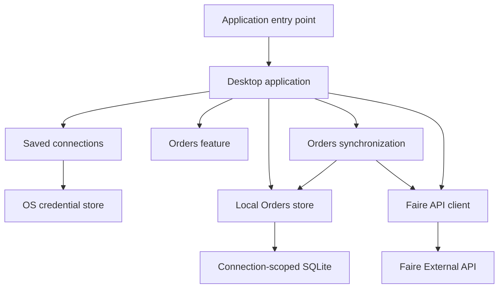

# faire-gui

A native desktop application for working with a Faire brand, built with Go and [Gio](https://gioui.org/).

`faire-gui` helps a brand manage saved Faire connections, verify brand details, work with locally cached orders, and export order data without placing credentials in application files or the local order database.

## What it does

- Saves Faire connections securely using the operating system credential store.
- Shows read-only Faire Brand Profile information for a selected connection.
- Provides a local-first Orders screen with filtering, sorting, search, selection, pagination, and detail views.
- Synchronizes orders from Faire in the background while keeping locally cached rows available.
- Exports New, Backordered, or selected orders as CSV files.
- Optionally downloads packing-slip PDFs alongside an export.
- Checks for compatible application updates on startup or on demand.

## Quick start

### Requirements

- Go **1.26.5** or the version declared in [`go.mod`](go.mod).
- macOS or Windows for the supported desktop and credential-store integrations.
- A Faire brand API token to create a direct-token connection in the app.

### Run the app

```sh
go run ./cmd/faire-gui
```

The app starts without an active connection. Use the sidebar to add or choose a saved connection, then open **Orders** or **Settings**.

### Run checks

```sh
gofmt -w application/*.go
go test ./...
go vet ./...
go test -race ./application ./internal/orderssync ./internal/ordersstore
```

Build release binaries for all supported targets with:

```sh
make all
```

## Connections and privacy

Connection metadata—such as a label, Faire brand ID, and authentication mode—is stored separately from credentials.

- Direct tokens and OAuth credential bundles are stored in macOS Keychain or Windows Credential Manager.
- Tokens entered in the app are masked and cleared from the input field before they are saved.
- The app can import a token from one environment variable explicitly named by the user; it never scans environment variables automatically.
- Credentials are not stored in SQLite, included in status messages, or written to logs.

The current UI supports creating direct-token connections. Existing OAuth connections can be viewed, edited, or deleted, but OAuth creation and reauthorization will be added with a future Authorization Code Grant flow.

## Orders and exports

Orders are designed to be useful even when a full sync is still running:

1. The app reads matching rows from the local, connection-scoped SQLite cache.
2. When a refresh is needed, it synchronizes with Faire in the background.
3. The visible table updates from the local cache after synchronization finishes.

This approach keeps the interface responsive and leaves useful cached rows visible if a later network request fails.

### Order data

The local cache is scoped to the selected saved connection. You can delete or rebuild one connection’s cached order data without affecting another connection.

Refreshing an individual order detail or looking up an order by display ID updates the local snapshot for that order. It does not change the list synchronization checkpoint.

### CSV and packing-slip exports

CSV exports are written to the current user’s Downloads directory. You can export New orders, Backordered orders, or rows selected in the table.

Packing-slip PDFs are an optional, explicit export choice:

- A private Downloads folder is created for the CSV and PDFs.
- PDFs are user-requested files, not cached application data.
- If one PDF fails, the CSV and any successfully downloaded PDFs are retained.
- The app reports only safe success/failure counts rather than private order or API details.

## Architecture

The project separates desktop UI concerns from Faire API access, credential management, local storage, and synchronization.



| Directory                                      | Responsibility                                                                         |
| ---------------------------------------------- | -------------------------------------------------------------------------------------- |
| [`cmd/faire-gui`](cmd/faire-gui)               | Application entry point.                                                               |
| [`application`](application)                   | Gio desktop UI, navigation, feature coordination, and safe background-result handling. |
| [`features/orders`](features/orders)           | Orders presentation and export formatting without UI, database, or HTTP dependencies.  |
| [`internal/ordersstore`](internal/ordersstore) | SQLite schema, local queries, snapshots, and sync state.                               |
| [`internal/orderssync`](internal/orderssync)   | Faire order pagination, synchronization windows, and checkpoints.                      |
| [`connections`](connections)                   | Saved connection metadata and operating-system credential access.                      |
| [`faire`](faire)                               | Typed Faire API client and endpoint services.                                          |
| [`updater`](updater)                           | Release checks and platform-specific update installation.                              |

### A note about Gio

Gio redraws the interface on each frame, while controls such as editors, buttons, and lists keep their interaction state between frames.

To keep the desktop UI responsive and race-free:

- UI state and Gio widgets are updated only by the frame loop.
- Database, network, credential-store, and filesystem work runs in background goroutines.
- Background work returns safe values to the UI and requests another frame when it finishes.

This matters most in Orders, where a user might change a connection, filter, selected order, or export while background work is still running. The application ignores outdated results rather than letting an older request overwrite the newer screen state.

## Design principles

The project is intentionally conservative about abstractions:

- keep credentials in the operating system credential store;
- keep SQLite data scoped to a saved connection ID;
- keep API pagination and synchronization checkpoints in `internal/orderssync`;
- keep local storage in `internal/ordersstore`;
- keep the UI responsive by doing I/O outside the Gio frame loop; and
- favor small feature-specific components over generic task, repository, or database frameworks.

These boundaries make it easier to extend the app—such as by adding Products—without coupling every feature to the desktop shell or the Orders implementation.

## Development

### Useful commands

```sh
# Run all tests.
go test ./...

# Check for common static issues.
go vet ./...

# Exercise the Orders-related concurrency paths.
go test -race ./application ./internal/orderssync ./internal/ordersstore

# Build all supported release binaries.
make all

# Remove generated binaries.
make clean
```

### Where to start reading the code

- [`cmd/faire-gui/main.go`](cmd/faire-gui/main.go) — program entry point.
- [`application/gio_runtime.go`](application/gio_runtime.go) — window event and frame loop.
- [`application/desktop_ui.go`](application/desktop_ui.go) — application shell.
- [`application/orders_controller.go`](application/orders_controller.go) — Orders background work and result coordination.
- [`application/orders_view_state.go`](application/orders_view_state.go) — persistent Orders controls and visible state.
- [`internal/orderssync/syncer.go`](internal/orderssync/syncer.go) — synchronization behavior.

When changing Orders, keep local-first loading, connection scoping, and stale-result protection intact. When changing synchronization, preserve the rule that only `internal/orderssync` owns remote cursor traversal and checkpoint writes.

## Dependencies

The direct dependencies are intentionally small:

| Dependency                                                               | Purpose                           |
| ------------------------------------------------------------------------ | --------------------------------- |
| [`gioui.org`](https://gioui.org/)                                        | Native immediate-mode desktop UI. |
| [`github.com/zalando/go-keyring`](https://github.com/zalando/go-keyring) | Credential-store integration.     |

The application also uses the pure-Go [`modernc.org/sqlite`](https://pkg.go.dev/modernc.org/sqlite) driver through its transitive module dependency. See [`go.mod`](go.mod) and `go.sum` for the complete, versioned dependency set.

## Configuration

The typed `faire` client supports direct brand API tokens and OAuth credentials. The desktop app creates selected clients through `connections.Manager`, which keeps clients and credentials scoped to the selected saved connection.

For local development or direct client use, a direct token can be supplied through:

```sh
export FAIRE_ACCESS_TOKEN="your-brand-token"
```

The client sends this value only in the `X-FAIRE-ACCESS-TOKEN` header.

OAuth client configuration requires application credentials and an OAuth access token. `FAIRE_BASE_URL` is optional and is primarily useful for tests or a future non-production environment. See the typed client configuration in [`faire`](faire) for details.

## Releases and updates

[`internal/buildinfo/version.go`](internal/buildinfo/version.go) contains the application version.

Before publishing a release:

1. Update the version to the intended `MAJOR.MINOR.PATCH` value.
2. Create the corresponding GitHub Release tag, for example `v1.2.3`.
3. Run `make all`.
4. Upload the unarchived executables using the exact asset names below.

| Target        | Required release asset        |
| ------------- | ----------------------------- |
| Darwin ARM64  | `faire-gui_darwin_arm64`      |
| Windows ARM64 | `faire-gui_windows_arm64.exe` |
| Windows AMD64 | `faire-gui_windows_amd64.exe` |

The app checks GitHub’s latest stable release on startup and can check again through **Settings → Check for updates**. When an update is accepted, it downloads the matching executable and performs the appropriate platform-specific replacement/restart flow.

## License

This project is available under the [MIT License](LICENSE).
