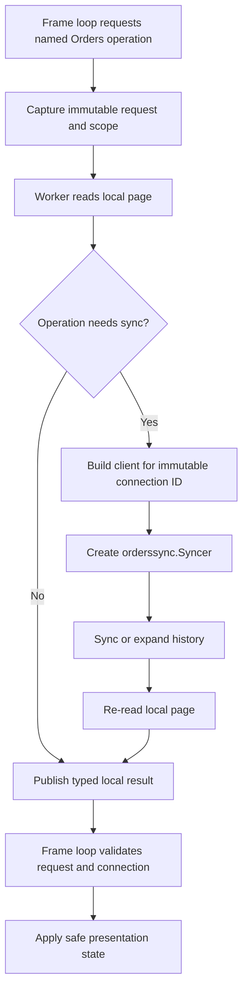

# Refactoring Plan: Orders Boundaries and Feature-Owned UI

## Status

**Planning only.** This document proposes no implementation changes by itself. It is intended to guide a sequence of small, behavior-preserving pull requests before adding the next substantial GUI workflow.

## Recommendation summary

All three proposed initiatives are worthwhile, with different urgency and scope:

| Initiative                                                   | Recommendation                                   | Why                                                                                                                                                                                                                                                                          |
| ------------------------------------------------------------ | ------------------------------------------------ | ---------------------------------------------------------------------------------------------------------------------------------------------------------------------------------------------------------------------------------------------------------------------------- |
| Resolve the packing-slip scope                               | **Do now**                                       | A shipped capability needs an explicit product decision and documented privacy boundaries. This plan is the current record of that decision.                                                                                                                                 |
| Move `DesktopUI` toward feature-owned state/controllers      | **Do before Products or another large workflow** | `DesktopUI` owns well over 100 fields spanning shell navigation, connection management, Orders, exports, dialogs, updater state, channels, request IDs, and Gio widgets. A second feature added in the same style would make the shell the permanent integration bottleneck. |
| Consolidate Orders workers and replace boolean-heavy loading | **Do as part of the Orders extraction**          | The current behavior is correct but orchestration is split across several paths and `loadOrders` selects distinct operations using several booleans. Explicit request modes make correctness and testing easier without introducing a generic async framework.               |

This plan deliberately does **not** recommend:

- a generic asynchronous task framework;
- a generic repository or database abstraction;
- a shared multi-feature SQLite schema;
- splitting the `faire` client into separate modules; or
- changing the Orders synchronization, checkpoint, privacy, or stale-result contracts.

Those abstractions should be considered only after a second completed feature demonstrates common behavior that the current design cannot express cleanly.

---

## Existing constraints that the refactor must preserve

The refactor is structural. The following behavior is non-negotiable:

1. **Gio frame-loop ownership**
   - Only the frame goroutine may mutate Gio widgets or rendered UI state.
   - Workers may capture immutable inputs, perform I/O, publish typed safe results, and request a redraw.

2. **Credential and privacy boundaries**
   - Credentials remain in the operating-system credential store.
   - Workers and result messages must not expose credentials, raw request URLs, headers, raw response bodies, or serialized private order snapshots.
   - SQLite remains scoped by immutable `connections.Connection.ID`.

3. **Orders synchronization contract**
   - The initial request uses the update boundary, sort, and page size.
   - Cursor follow-up requests use only the opaque cursor.
   - Page upserts may survive partial failure, but the completed watermark advances only after all pages succeed.
   - Incremental sync retains the overlap window.

4. **Stale-result protection**
   - A result must not update the current screen if its request ID, active connection, selected order, or export scope is no longer current.

5. **Current user behavior**
   - Local rows appear before synchronization when available.
   - The active connection cannot change while a local-data action is running.
   - Inactive connection rebuilds do not replace the active Orders table.
   - Detail refreshes update the local snapshot without advancing the list synchronization watermark.

6. **No generic framework by implication**
   - The result should make Orders feature ownership clearer, not replace its explicit state machine with a reflection-, interface-, or callback-heavy task system.

---

## Initiative 1: resolve the packing-slip product scope

### Why this is a good idea

The current implementation supports packing-slip PDFs through:

- `application/orders_actions.go` export options and PDF download workflow;
- `faire/services_orders.go` PDF retrieval; and
- dedicated tests for successful, partial-failure, filename, and export completion behavior.

The capability has privacy and filesystem-retention implications beyond ordinary CSV export. Its scope therefore needs an explicit decision, recorded in this plan, rather than being inferred solely from the existence of an API endpoint.

### Product decision

**Packing-slip PDFs are an officially supported Orders feature.** They are user-requested export artifacts, not cached application data. Future changes to PDF retrieval, filesystem export, and retention therefore require product and privacy review.

The following constraints are mandatory:

1. Packing slips are generated only following an explicit user export choice.
2. PDFs are written as private user-requested artifacts under Downloads and are not stored in SQLite.
3. No new artifact type is added solely because a related endpoint exists.
4. Successful PDFs remain available when individual downloads fail; failures are reported only as safe counts.

No packing-slip-only README update is needed now. The README does not currently enumerate the Orders workflow, so adding this one capability in isolation would make the public description less coherent. If the README is later expanded to describe Orders, include packing-slip behavior at that time.

### Acceptance criteria

- This plan, implementation, and tests describe the same packing-slip scope.
- The plan distinguishes local persistent cache data from user-requested exported artifacts.
- No raw API or order-detail data is added to status messages or logs.

---

## Initiative 2: give features ownership of UI state and orchestration

### Why this is a good idea

The current package structure is sound, but `application.DesktopUI` remains the owner of almost every UI concern. It currently combines:

- window and application lifecycle;
- navigation and modal routing;
- connection and brand-profile state;
- Orders list, filters, selection, detail, export, and local-data action state;
- Gio widgets for all of those areas;
- result channels and request IDs for several unrelated workflows; and
- updater state.

This is manageable for one rich feature, but it is the point at which adding Products in the same pattern would create increasingly coupled state and harder-to-review changes.

The objective is not to make feature packages import Gio. The `features/orders` package remains Gio-free. Instead, feature UI ownership stays in `application`, where Gio is already allowed, while domain presentation remains in `features/orders`.

### Target shape

Keep `DesktopUI` as the application shell and introduce an unexported Orders-owned component inside `application`.

```text
cmd/faire-gui
        |
        v
application
  ├── DesktopUI (window lifecycle, shell navigation, connection selection, shared modals)
  ├── ordersController (Orders worker orchestration and stale-result checks)
  ├── ordersViewState (Orders-only Gio controls and frame-owned presentation state)
  └── connectionController / connection view state (later, when Connections work warrants it)
        |
        +--> features/orders
        +--> internal/orderssync --> internal/ordersstore
        +--> connections --> OS credential store
        +--> faire
```

Suggested internal types, all unexported and all in `application`:

```go
// ordersController coordinates Orders workers and applies only typed, safe worker results.
type ordersController struct {
    ctx     context.Context
    store   ordersstore.Store
    manager *connections.Manager

    view ordersViewState

    loadResults   chan orderLoadResult
    detailResults chan orderDetailResult
    exportResults chan orderExportResult
    schedule      chan struct{}
}

// ordersViewState owns all frame-loop-only Orders presentation state and Gio controls.
type ordersViewState struct {
    state orders.State

    newCount           int
    loadRequestID      uint64
    detailRequestID    uint64
    exportRequestID    uint64
    historyBoundaryKnown bool
    // Orders-specific dialogs, lists, editors, clickables, and selection state.
}
```

The exact names are intentionally flexible. The important ownership rules are:

- `DesktopUI` retains shell-wide state: window, theme, application cancellation, navigation, saved connection list, active connection selection, and updater state.
- The Orders component owns every Orders-only widget, request ID, channel, dialog, and presentation value.
- The Orders component receives the active connection as a value or small scope object; it must not own global connection switching.
- Workers publish typed Orders events only. They never mutate `ordersViewState` or shell state.
- Cross-feature effects, such as an inactive connection rebuild changing the Brand Profile status, are emitted as explicit safe events for the shell to apply.

### Explicit boundary for local-data actions

Connection-scoped data actions touch two visual areas today: the Brand Profile card and, if active, the Orders screen. Preserve that relationship without allowing Orders workers to mutate `DesktopUI` directly.

Introduce a safe event shaped conceptually as:

```go
// ordersDataActionEvent reports safe progress or completion for one connection-scoped local-data action.
type ordersDataActionEvent struct {
    ConnectionID string
    Status       string
    Done         bool
}
```

`DesktopUI` consumes this event to update the Brand Profile status. When the event belongs to the active connection, it delegates the Orders-screen update to `ordersController`. This keeps the cross-feature dependency visible and connection-scoped.

### Migration steps

#### Phase 2.1: characterize the current behavior

Before moving state, add or strengthen focused tests where coverage is missing for:

- request ID rejection after a connection switch;
- request ID rejection after a filter or selection change;
- active versus inactive local-data rebuild behavior;
- disabled connection switching during a local-data action;
- detail refresh not advancing the list watermark; and
- export completion not applying to a newer export request.

Existing tests already cover several of these behaviors. The goal is not test volume; it is to lock down the seams that will move.

#### Phase 2.2: introduce the Orders component without changing behavior

1. Add `ordersController` and `ordersViewState` in new `application/orders_controller.go` and `application/orders_view_state.go` files.
2. Construct the controller from `newDesktopUIWithOrders`.
3. Initially delegate through thin methods while keeping method behavior identical.
4. Move Orders-only fields from `DesktopUI` to `ordersViewState` in small compile-safe groups:
   - list/filter/selection state;
   - detail state and controls;
   - export state and controls;
   - result channels, scheduler channel, and request IDs; and
   - local-data action state.
5. Move the corresponding methods from `DesktopUI` to `ordersController` as each group moves.

The shell can pass only the values the controller needs for an operation, such as an immutable connection ID and label. Avoid giving the controller broad mutable access to the shell.

#### Phase 2.3: move Orders rendering ownership

Move the Orders page and detail rendering methods from `DesktopUI` to the Orders component. The shell remains responsible for selecting the active route:

```go
switch ui.selectedTab {
case ordersTab:
    return ui.orders.Layout(gtx, ui.ordersScope())
}
```

`ordersScope` should contain non-secret, session-scoped inputs only, for example the active connection ID and label. It must not carry credentials or raw client references.

#### Phase 2.4: clean shell-facing delegation

After the extraction, `DesktopUI` should retain concise delegates for shell events:

```go
func (ui *DesktopUI) setActiveConnection(connection connections.Connection) {
    // Shell updates session-wide connection selection.
    // Orders is notified with the new immutable connection scope.
}
```

The Orders implementation should no longer require unrelated shell fields to render, drain results, or start worker operations.

### Files expected to change during implementation

| File                                | Expected change                                                                          |
| ----------------------------------- | ---------------------------------------------------------------------------------------- |
| `application/desktop_ui.go`         | Retain shell construction and layout; remove Orders-owned state over staged commits.     |
| `application/orders_actions.go`     | Move Orders worker, result, detail, export, and data-action methods to the controller.   |
| `application/orders_page.go`        | Move Orders page rendering to the Orders component.                                      |
| `application/order_detail_page.go`  | Move detail rendering and controls to the Orders component.                              |
| `application/gio_runtime.go`        | Delegate Orders result draining and scheduling to the component.                         |
| `application/navigation.go`         | Delegate active Orders route rendering and connection-scope notifications.               |
| `application/connection_actions.go` | Consume the explicit local-data action event rather than reaching into Orders internals. |
| `application/application_test.go`   | Update construction helpers and retain behavioral tests.                                 |
| `application/orders_controller.go`  | New: Orders-specific controller and worker coordination.                                 |
| `application/orders_view_state.go`  | New: frame-owned Orders presentation state and Gio controls.                             |

No changes should be needed to `features/orders`, `internal/orderssync`, `internal/ordersstore`, `connections`, or `faire` for the state-ownership extraction alone.

### Acceptance criteria

- `DesktopUI` is a shell, not the owner of Orders-specific widgets, channels, request IDs, and dialogs.
- `features/orders` remains Gio-free and persistence-free.
- Workers still publish only safe typed result values.
- The active connection guard remains intact during local-data actions.
- Existing behavior and existing test coverage remain unchanged.

---

## Initiative 3: consolidate Orders worker orchestration

### Why this is a good idea

The existing `loadOrders` workflow is behaviorally correct, but it performs several different operations behind a signature containing multiple booleans:

- append an additional local page;
- render local data only;
- decide whether scheduled synchronization is due;
- perform an ordinary incremental sync;
- perform an explicit history expansion;
- restore a stored history boundary; and
- reload local data after synchronization.

Separate paths also independently create an authenticated client and an `orderssync.Syncer`, especially regular loading and inactive connection rebuilds.

This creates a maintenance risk: a future change to sync error handling, client construction, or status generation could be applied to one route but not another. Explicit operations make the state machine reviewable.

### Target design

Use a small Orders-specific request model. Do not make it a reusable task framework.

```go
// ordersLoadKind identifies the user-visible local-read or synchronization operation.
type ordersLoadKind uint8

const (
    ordersLoadInitial ordersLoadKind = iota
    ordersLoadNextPage
    ordersLoadScheduledRefresh
    ordersLoadManualRefresh
    ordersLoadLocalOnly
    ordersLoadRebuild
)

// ordersLoadRequest is an immutable worker input captured before a goroutine starts.
type ordersLoadRequest struct {
    RequestID     uint64
    ConnectionID  string
    State         orders.State
    Kind          ordersLoadKind
    RestoreBoundary bool
}
```

The final shape can use more focused methods instead of an enum if that reads better:

```go
StartInitialLoad(scope)
LoadNextPage(scope)
Refresh(scope, historyBoundary)
Rebuild(scope)
LoadLocalOnly(scope)
```

Either approach is acceptable. The essential rule is that a call site should name the operation it requests rather than pass positional booleans whose meaning must be reconstructed from the call.

### Worker responsibilities

The Orders controller should separate the workflow into a small set of composable private operations:

| Operation                 | Responsibility                                                                                                                                    |
| ------------------------- | ------------------------------------------------------------------------------------------------------------------------------------------------- |
| `readStoredBoundary`      | Read the connection-scoped retained-history boundary when needed.                                                                                 |
| `loadLocalPage`           | Convert safe feature state to a local `ordersstore.ListQuery`, then present storage projections as `orders.Row` values.                           |
| `syncConnection`          | Create the client, construct `orderssync.Syncer`, choose normal or history-expansion sync, and return only an `orderssync.Summary` or safe error. |
| `loadAndMaybeSync`        | Apply the local-first sequence: local page, due check, optional sync, final local page.                                                           |
| `runDataAction`           | Delete one connection's cache and optionally call the shared synchronization operation.                                                           |
| `lookupAndPersistOrder`   | Perform direct lookup fallback, project/store it, and return a safe list result.                                                                  |
| `refreshAndPersistDetail` | Fetch one order, project/store it without advancing the checkpoint, and return typed detail presentation.                                         |

`syncConnection` is the key consolidation point. Both regular synchronization and inactive rebuilds should use it. It should keep the existing `orderssync.Syncer` behavior; it must not reproduce pagination or checkpoint logic in `application`.

### Proposed flow



### Migration steps

#### Phase 3.1: replace boolean call sites with named operations

1. Add the request type or focused operation methods.
2. Change call sites in Orders layout, scheduler, connection selection, and data-action confirmation to request a named operation.
3. Preserve the current result types and result application logic during this phase.
4. Delete the old boolean-heavy entry point only after every caller uses the named form.

#### Phase 3.2: extract shared synchronization construction

1. Extract the common client and `orderssync.New` construction into `syncConnection`.
2. Route ordinary incremental sync, manual history expansion, active rebuild, and inactive rebuild through it.
3. Keep phase-specific status formatting at the application boundary, where user-safe messaging already belongs.
4. Keep `orderssync` as the sole owner of cursor traversal, overlap calculation, and checkpoint writes.

#### Phase 3.3: consolidate remote single-order persistence

The direct lookup fallback and detail refresh both fetch a remote order and persist it with `orderssync.RecordFromOrder` followed by `Store.UpsertOrders`.

Extract a narrow helper only if it can preserve each workflow's distinct behavior:

- direct lookup returns a list row and must not advance the checkpoint;
- detail refresh returns a typed detail model and must not advance the checkpoint.

Do not collapse these into one opaque “remote order task.” The shared unit should be limited to fetch-and-persist behavior.

### Error and cancellation rules

The refactor must retain current safe classifications:

- `400 Bad Request` identifies a safe synchronization phase and whether it was a cursor follow-up.
- authentication and rate-limit failures remain actionable but credential-safe;
- `context.Canceled` does not show as an unexplained failure;
- storage failures do not discard an already successful local read; and
- stale worker failures cannot overwrite newer successful state.

Every worker result remains value-only. It must not contain a `*faire.Client`, a raw `faire.Order` snapshot, credential values, request URLs, response bodies, or filesystem paths beyond intentional user-facing export folder/filename values.

### Acceptance criteria

- No Orders operation entry point uses a positional group of booleans to select its semantic behavior.
- Regular and inactive rebuild synchronization share one client-and-syncer construction path.
- Only `internal/orderssync` traverses cursors and updates checkpoints.
- Direct lookup and detail refresh still persist a snapshot without advancing the list checkpoint.
- Existing stale-result, local-first, and connection-scoping tests pass.

---

## Implementation order

Use small, independently reviewable changes:

1. **Packing-slip product decision**
   - Decide whether packing slips are accepted scope.
   - Record the resulting privacy and retention constraints in this plan.

2. **Characterization tests**
   - Fill only meaningful gaps around stale results, connection scope, and local-data actions.

3. **Introduce Orders-owned state**
   - Add controller/view-state types.
   - Move fields and render methods without changing worker behavior.

4. **Move Orders result channels and request IDs**
   - Keep channel behavior and result structures intact.
   - Make the controller responsible for draining and validating Orders events.

5. **Replace boolean-heavy operation selection**
   - Convert callers to named operations or immutable request values.
   - Maintain existing status strings initially to keep behavioral diffs small.

6. **Consolidate sync setup and data-action workflows**
   - Add the shared `syncConnection` operation.
   - Route active and inactive rebuilds through it.

7. **Optional narrow fetch-and-persist helper**
   - Extract only the shared remote single-order persistence portion if the tests show behavior remains clearer.

8. **Cleanup and review**
   - Remove transitional delegates and duplicated state.
   - Update package and structural documentation to describe the final ownership accurately.

Each step should compile, pass tests, and be safe to revert independently.

---

## Validation plan

At minimum, run after each implementation stage:

```sh
gofmt -w application/*.go
go test ./...
go vet ./...
```

For the state/concurrency extraction, also run focused race detection where supported:

```sh
go test -race ./application ./internal/orderssync ./internal/ordersstore
```

Before release, validate supported build targets without changing architecture behavior:

```sh
make all
```

Manual validation should cover:

1. local Orders appear before an eligible refresh completes;
2. a manual history expansion saves and restores its boundary;
3. a failed cursor page leaves old local rows visible and does not advance the checkpoint;
4. an active rebuild blocks connection switching;
5. an inactive rebuild reports on its Brand Profile card without replacing the active Orders table;
6. direct order lookup persists a fetched order locally;
7. detail refresh updates only that snapshot and leaves the list checkpoint unchanged;
8. an old worker result cannot overwrite a newer filter, selection, export, or active connection; and
9. packing-slip export behavior matches the adopted architecture decision.

---

## Risks and mitigations

| Risk                                                        | Mitigation                                                                                                                                                    |
| ----------------------------------------------------------- | ------------------------------------------------------------------------------------------------------------------------------------------------------------- |
| The refactor accidentally changes synchronization behavior. | Do not modify `internal/orderssync` in the extraction. Preserve existing sync tests and add characterization tests before moving orchestration.               |
| The controller becomes another large god object.            | Limit it to the Orders feature. Keep presentation formatting in `features/orders`, persistence in `ordersstore`, and remote sync correctness in `orderssync`. |
| Cross-feature local-data status becomes hidden or implicit. | Use an explicit, connection-scoped safe event consumed by the shell.                                                                                          |
| Generic abstractions obscure the state machine.             | Keep types and methods Orders-specific until a second feature demonstrates a stable common contract.                                                          |
| UI regressions arise from moving Gio controls.              | Move widgets in coherent groups and preserve their lifetime in a single long-lived Orders view-state object.                                                  |
| Test fixtures become cumbersome after ownership changes.    | Provide a focused `newOrdersControllerForTest` helper instead of exposing production internals or adding broad interfaces.                                    |

---

## Definition of done

This refactor is complete when:

- this plan accurately states the packing-slip product decision and its privacy constraints;
- `DesktopUI` is visibly an application shell rather than the owner of all Orders internals;
- Orders UI state, Gio controls, channels, request IDs, and worker coordination have feature ownership inside `application`;
- named Orders operations replace boolean-heavy worker selection;
- syncer creation is shared between ordinary synchronization and rebuild workflows;
- no privacy, checkpoint, stale-result, or connection-scoping guarantees regress; and
- tests, race-focused tests, static analysis, and supported release builds pass.
